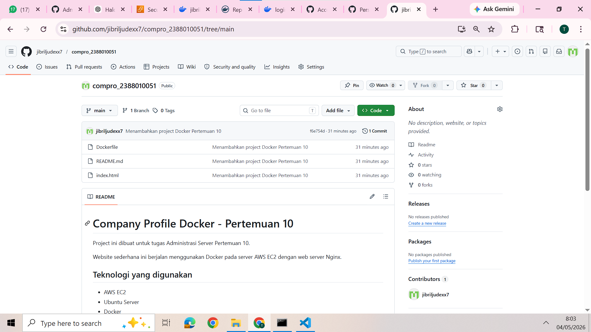
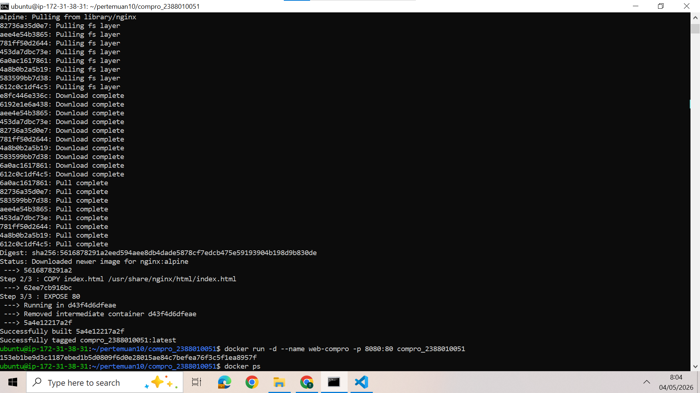
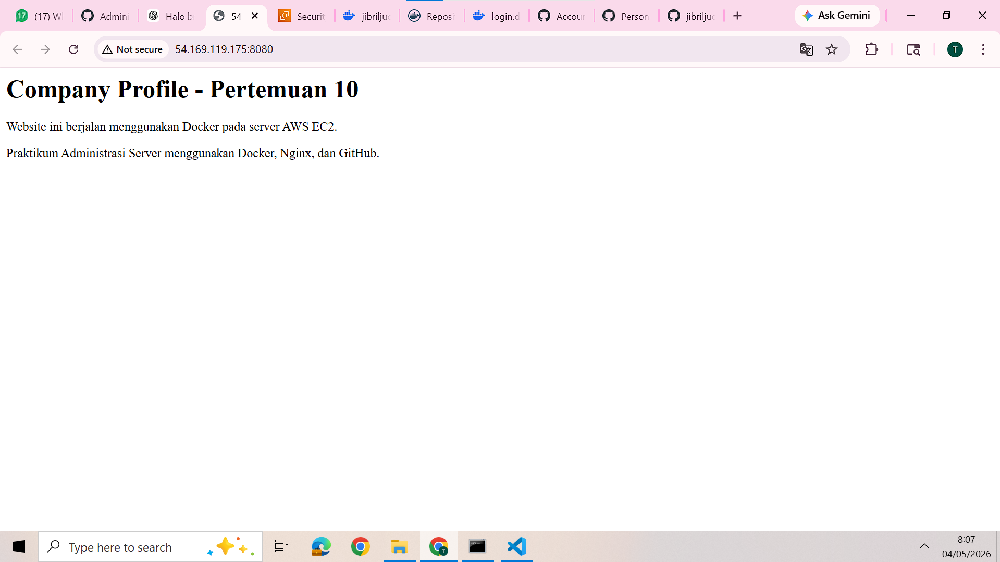
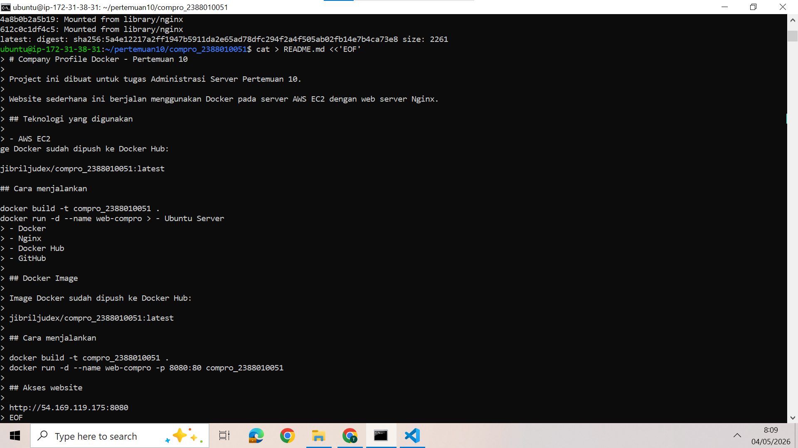
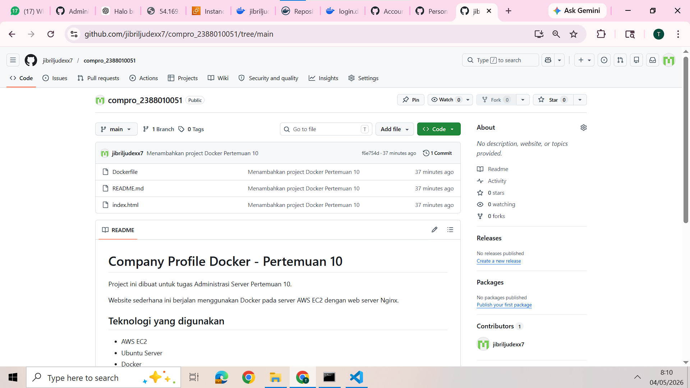

# Pertemuan 10 - Intro Docker Engine pada Instance EC2 AWS

## 1. Instalasi Docker pada Ubuntu Server

Pada pertemuan ini dilakukan instalasi Docker Engine pada server Ubuntu yang berjalan di instance EC2 AWS. Docker digunakan agar aplikasi dapat dijalankan di dalam container sehingga proses deployment menjadi lebih praktis dan konsisten.

Langkah pertama adalah melakukan update package pada sistem operasi Ubuntu.

```bash
sudo apt-get update
sudo apt-get upgrade -y
```

)

Setelah itu install beberapa package pendukung yang dibutuhkan untuk menambahkan repository Docker.

```bash
sudo apt-get install -y ca-certificates curl git
```

Kemudian tambahkan GPG key Docker ke dalam server.

```bash
sudo install -m 0755 -d /etc/apt/keyrings
sudo curl -fsSL https://download.docker.com/linux/ubuntu/gpg -o /etc/apt/keyrings/docker.asc
sudo chmod a+r /etc/apt/keyrings/docker.asc
```

)

Selanjutnya tambahkan repository Docker ke daftar source Ubuntu.

```bash
sudo tee /etc/apt/sources.list.d/docker.sources > /dev/null <<'EOF'
Types: deb
URIs: https://download.docker.com/linux/ubuntu
Suites: $(. /etc/os-release && echo "${UBUNTU_CODENAME:-$VERSION_CODENAME}")
Components: stable
Architectures: $(dpkg --print-architecture)
Signed-By: /etc/apt/keyrings/docker.asc
EOF
```

Setelah repository berhasil ditambahkan, update kembali package list dan install Docker Engine.

```bash
sudo apt-get update
sudo apt-get install -y docker-ce docker-ce-cli containerd.io docker-buildx-plugin docker-compose-plugin
```

Untuk memastikan Docker sudah berjalan, gunakan perintah berikut.

```bash
sudo systemctl status docker
sudo docker --version
sudo docker run hello-world
```

))

## 2. Membuat Akun dan Repository Docker Hub

Setelah Docker terpasang pada server, langkah berikutnya adalah menyiapkan Docker Hub. Docker Hub digunakan sebagai tempat menyimpan image Docker yang sudah dibuat agar bisa digunakan kembali di server lain.

Langkah-langkahnya yaitu:

1. Buka halaman Docker Hub.
2. Login atau registrasi akun Docker Hub.
3. Masuk ke menu **Repositories**.
4. Klik **Create repository**.
5. Isi nama repository dengan format `compro_nim`.
6. Atur visibility menjadi **Public**.
7. Klik **Create**.

)

## 3. Membuat Access Token Docker Hub

Access token digunakan sebagai pengganti password ketika login Docker Hub melalui terminal. Token ini diperlukan ketika akan melakukan push image dari server ke Docker Hub.

Langkah membuat access token:

1. Klik foto profil Docker Hub.
2. Masuk ke **Account Settings**.
3. Pilih menu **Personal access tokens**.
4. Klik **Generate new token**.
5. Isi deskripsi token.
6. Pilih permission **Read & Write**.
7. Simpan token yang muncul.

)

> Catatan: token bersifat rahasia, jadi jangan ditampilkan penuh pada laporan atau diupload ke GitHub.

## 4. Membuat Project Web Statis

Project yang dibuat pada praktikum ini berupa web company profile sederhana. Folder project diberi nama `compro_nim` dan berisi file `index.html`, `Dockerfile`, `.dockerignore`, serta `README.md`.

Struktur folder project:

```text
compro_nim/
├── index.html
├── Dockerfile
├── .dockerignore
└── README.md
```

Isi file `Dockerfile`:

```dockerfile
FROM nginx:alpine

COPY index.html /usr/share/nginx/html/index.html

EXPOSE 80
```

![Folder project]
## 5. Build dan Menjalankan Container Docker

Setelah file project selesai dibuat, image Docker dapat dibangun menggunakan perintah berikut.

```bash
cd compro_nim
docker build -t compro_nim .
```

Setelah proses build selesai, jalankan container dengan port mapping dari port `8080` di server ke port `80` di container.

```bash
docker run -d --name web-compro -p 8080:80 compro_nim
```

Untuk mengecek container yang sedang berjalan, gunakan perintah:

```bash
docker ps
```

![Build dan menjalankan container]

Setelah container berjalan, web dapat diakses melalui browser dengan format berikut.

```text
http://IP_PUBLIC_EC2:8080
```

![Web berhasil berjalan]

## 6. Push Image ke Docker Hub

Sebelum push image, login terlebih dahulu ke Docker Hub melalui terminal.

```bash
docker login
```

Setelah login berhasil, berikan tag pada image sesuai format repository Docker Hub.

```bash
docker tag compro_nim USERNAME_DOCKER/compro_nim:latest
```

Kemudian push image ke Docker Hub.

```bash
docker push USERNAME_DOCKER/compro_nim:latest
```

![Push image ke Docker Hub]

## 7. Push Project ke GitHub

Selain image Docker yang disimpan di Docker Hub, source code project juga diupload ke GitHub agar file project terdokumentasi dengan baik.

Langkah pertama adalah membuat repository baru di GitHub dengan nama `compro_nim`. Setelah repository dibuat, jalankan perintah berikut pada folder project.

```bash
git init
git add .
git commit -m "Menambahkan project Docker web statis"
git branch -M main
git remote add origin https://github.com/USERNAME_GITHUB/compro_nim.git
git push -u origin main
```

![Repository GitHub]

## 8. Kesimpulan

Berdasarkan praktikum yang telah dilakukan, Docker dapat digunakan untuk menjalankan aplikasi web statis dalam bentuk container. Dengan menggunakan Dockerfile, aplikasi dapat dibangun menjadi image dan dijalankan secara konsisten pada server. Selain itu, image dapat disimpan ke Docker Hub, sedangkan source code project dapat diupload ke GitHub sebagai dokumentasi dan version control.
