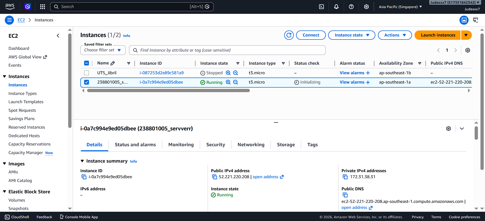
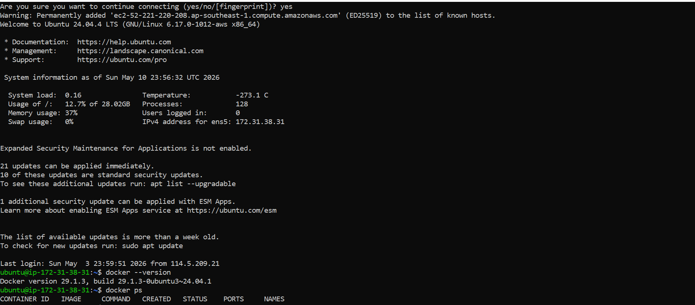
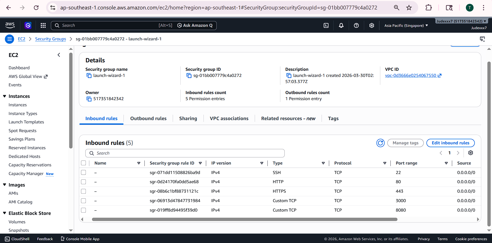
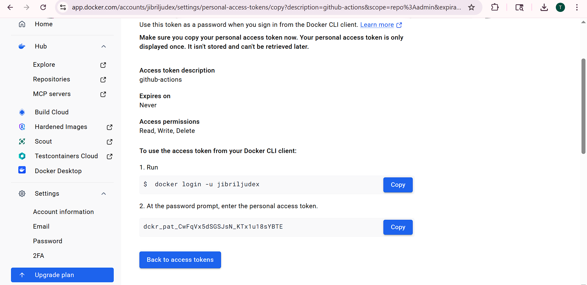
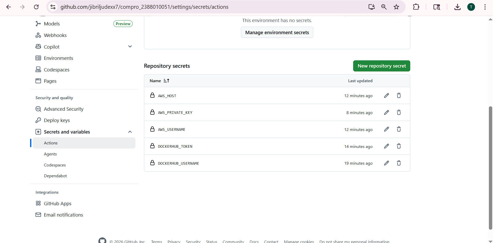
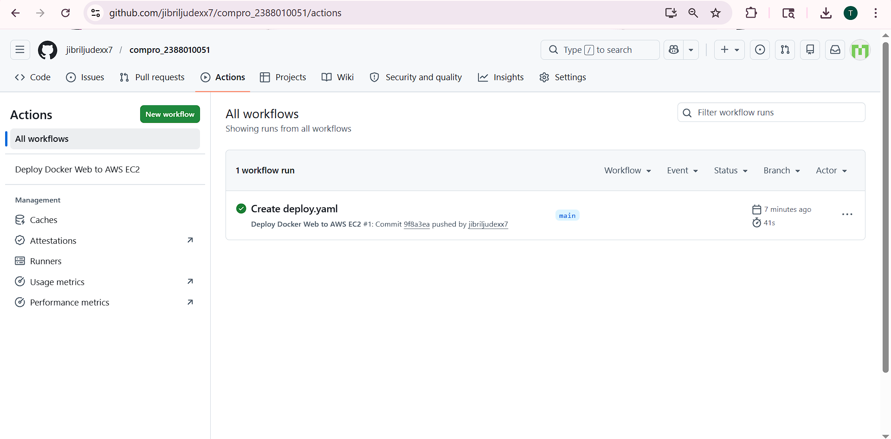
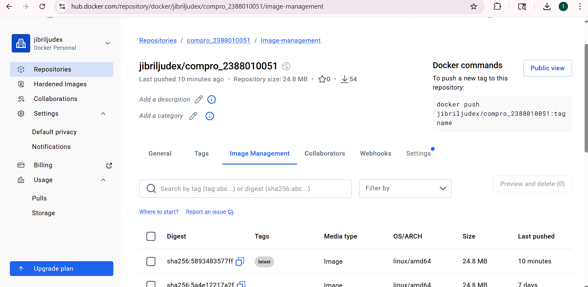
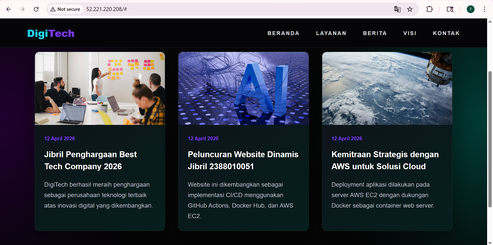

# LAPORAN PRAKTIKUM ADMINISTRASI SERVER  
## PERTEMUAN 11  
## IMPLEMENTASI CI/CD MENGGUNAKAN GITHUB ACTIONS, DOCKER HUB, DAN AWS EC2

---

**Nama**  : Muhammad Jibril Judex Facti Aliyudin
**NIM**   : 2388010051
**Kelas** : Informatika 6B
**Mata Kuliah** : Administrasi Server  

---

## 1. Tujuan Praktikum

Praktikum ini bertujuan untuk menerapkan CI/CD menggunakan GitHub Actions. Proses CI/CD digunakan untuk melakukan build Docker image, push image ke Docker Hub, dan deploy otomatis ke server AWS EC2.

Alur CI/CD:

```text
GitHub → GitHub Actions → Docker Hub → AWS EC2
```

---

## 2. Alat dan Bahan

Alat dan bahan yang digunakan:

1. AWS EC2 Ubuntu Server
2. Docker
3. Docker Hub
4. GitHub Repository
5. GitHub Actions
6. File private key `.pem`
7. Browser dan terminal SSH

---

## 3. Langkah-Langkah Praktikum

### 3.1 Menyalakan AWS EC2

Instance EC2 dinyalakan melalui menu **EC2 → Instances → Instance state → Start instance**. Setelah itu, status instance berubah menjadi **Running** dan Public IPv4 digunakan sebagai alamat server.

📸 **Screenshot 1 - EC2 Running**

![Screenshot 1]

---

### 3.2 Login ke Server EC2

Login ke server dilakukan menggunakan SSH dengan private key `.pem`.

```bash
cd /d C:\aws
ssh -i "judex22.pem" ubuntu@IP_PUBLIC_EC2
```

📸 **Screenshot 2 - Berhasil SSH ke Server**

![Screenshot 2]

---

### 3.3 Mengecek Docker

Docker dicek untuk memastikan server siap menjalankan container.

```bash
docker --version
docker ps
```

📸 **Screenshot 3 - Docker Berjalan**

![Screenshot 3]

---

### 3.4 Membuka Port 80

Port `80` dibuka melalui **Security Group → Inbound rules → Edit inbound rules** dengan konfigurasi:

| Type | Port | Source |
|---|---|---|
| HTTP | 80 | 0.0.0.0/0 |

📸 **Screenshot 4 - Port 80 Terbuka**

![Screenshot 4]

---

### 3.5 Membuat Token Docker Hub

Token Docker Hub dibuat agar GitHub Actions dapat login dan push image secara otomatis ke Docker Hub.

Token ini nantinya disimpan di GitHub Secrets sebagai:

```text
DOCKERHUB_TOKEN
```

📸 **Screenshot 5 - Docker Hub Token**

![Screenshot 5]

---

### 3.6 Menambahkan GitHub Secrets

GitHub Secrets digunakan untuk menyimpan data penting yang diperlukan workflow.

Secrets yang dibuat:

| Name | Keterangan |
|---|---|
| DOCKERHUB_USERNAME | Username Docker Hub |
| DOCKERHUB_TOKEN | Token Docker Hub |
| AWS_HOST | Public IPv4 EC2 |
| AWS_USERNAME | ubuntu |
| AWS_PRIVATE_KEY | Isi file `.pem` |

📸 **Screenshot 6 - GitHub Secrets**

![Screenshot 6]

---

### 3.7 Membuat File Workflow GitHub Actions

File workflow dibuat dengan nama:

```text
.github/workflows/deploy.yaml
```

Isi file:

```yaml
name: Deploy Docker Web to AWS EC2

on:
  push:
    branches: [ main ]

jobs:
  build-and-push:
    runs-on: ubuntu-latest

    steps:
      - name: Checkout source code
        uses: actions/checkout@v4

      - name: Login to Docker Hub
        uses: docker/login-action@v3
        with:
          username: ${{ secrets.DOCKERHUB_USERNAME }}
          password: ${{ secrets.DOCKERHUB_TOKEN }}

      - name: Build and push Docker image
        uses: docker/build-push-action@v5
        with:
          context: .
          push: true
          tags: ${{ secrets.DOCKERHUB_USERNAME }}/compro_2388010051:latest

  deploy:
    needs: build-and-push
    runs-on: ubuntu-latest

    steps:
      - name: Deploy to AWS EC2 via SSH
        uses: appleboy/ssh-action@v1.0.3
        with:
          host: ${{ secrets.AWS_HOST }}
          username: ${{ secrets.AWS_USERNAME }}
          key: ${{ secrets.AWS_PRIVATE_KEY }}
          port: 22
          script: |
            docker rm -f compro_2388010051 || true
            docker pull ${{ secrets.DOCKERHUB_USERNAME }}/compro_2388010051:latest
            docker run -d --name compro_2388010051 -p 80:80 ${{ secrets.DOCKERHUB_USERNAME }}/compro_2388010051:latest
```

📸 **Screenshot 7 - File deploy.yaml**

![Screenshot 7]

---

### 3.8 Mengecek GitHub Actions

Setelah file `deploy.yaml` di-commit ke branch `main`, GitHub Actions berjalan otomatis. Workflow berhasil jika status job berwarna hijau.

📸 **Screenshot 8 - GitHub Actions Berhasil**

![Screenshot 8]

---

### 3.9 Mengecek Docker Hub

Setelah workflow selesai, Docker image otomatis ter-push ke Docker Hub.

📸 **Screenshot 9 - Docker Hub Image**

![Screenshot 9]

---

### 3.10 Mengecek Website

Website dicek melalui Public IPv4 EC2:

```text
http://IP_PUBLIC_EC2
```

Jika website tampil, maka deployment otomatis berhasil.

📸 **Screenshot 10 - Website Berhasil Deploy**

![Screenshot 10]

---

## 4. Hasil Praktikum

Hasil praktikum menunjukkan bahwa GitHub Actions berhasil menjalankan proses CI/CD. Ketika terjadi perubahan pada repository GitHub, sistem otomatis melakukan build Docker image, push ke Docker Hub, dan deploy ke server AWS EC2.

Website berhasil diakses melalui Public IPv4 EC2, sehingga proses deployment otomatis dinyatakan berhasil.

---

## 5. Kesimpulan

Berdasarkan praktikum ini, dapat disimpulkan bahwa:

1. GitHub Actions dapat digunakan untuk proses CI/CD.
2. Docker Hub digunakan untuk menyimpan Docker image.
3. AWS EC2 digunakan sebagai server deployment.
4. GitHub Secrets digunakan untuk menyimpan data penting seperti token dan private key.
5. Proses deployment menjadi lebih otomatis dan tidak perlu dilakukan secara manual.

---

