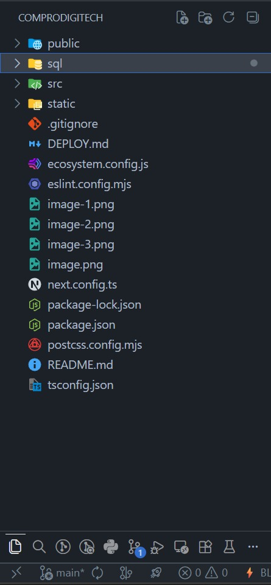
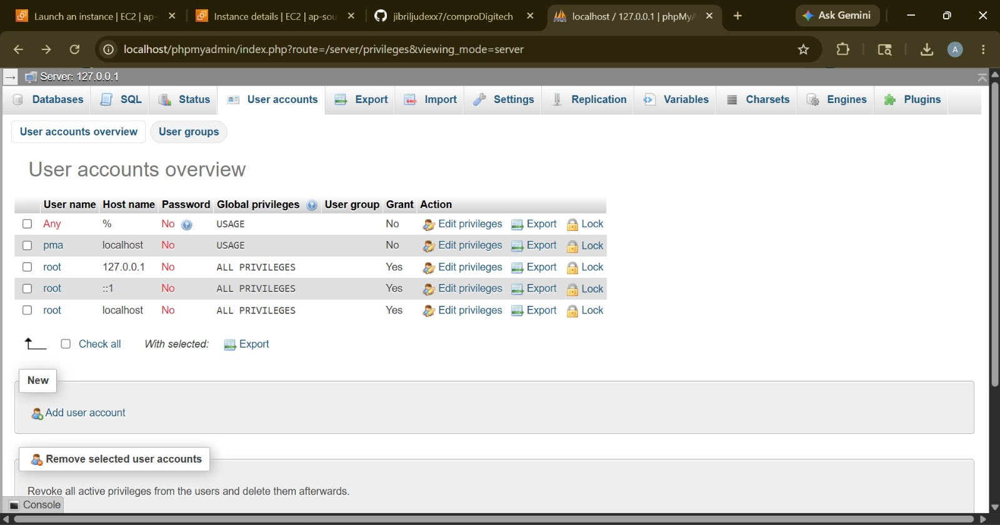
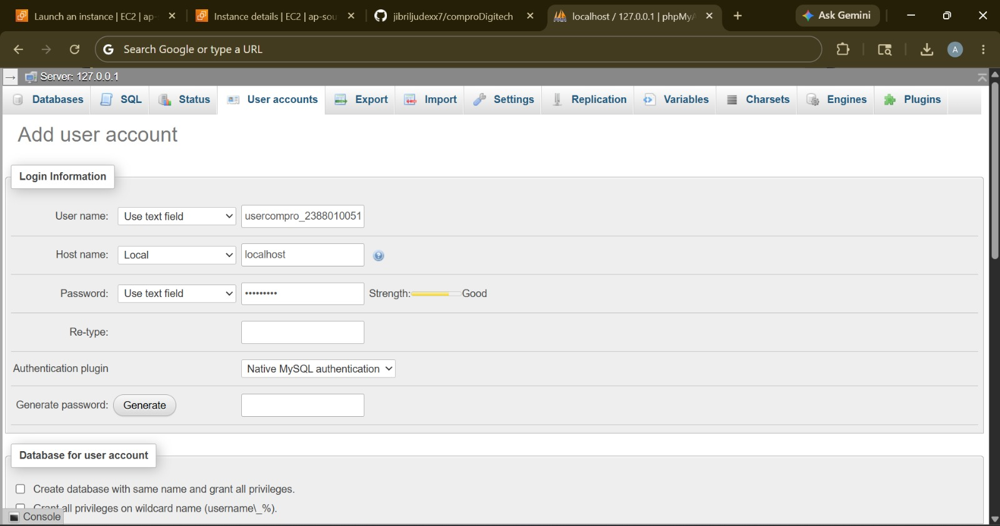
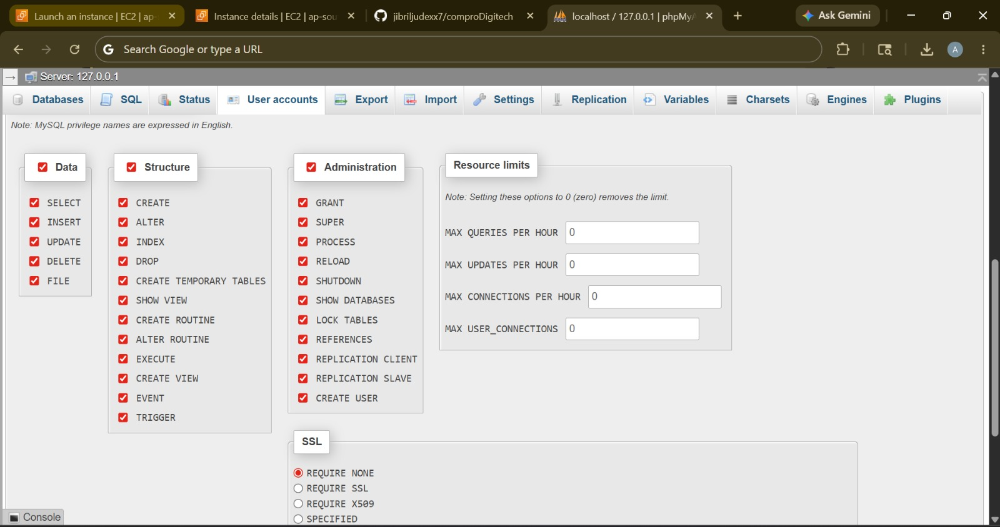
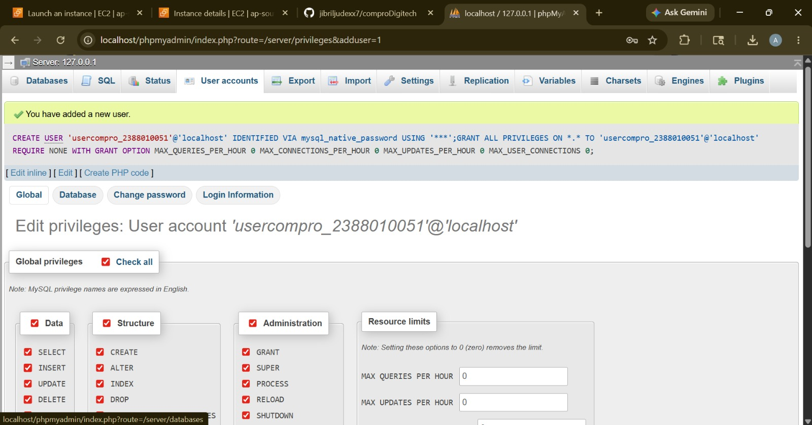
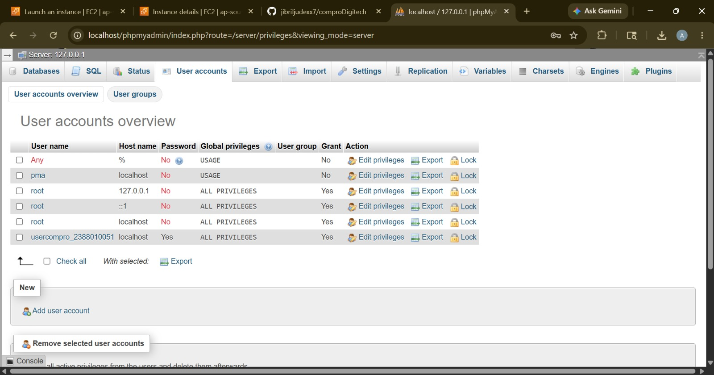
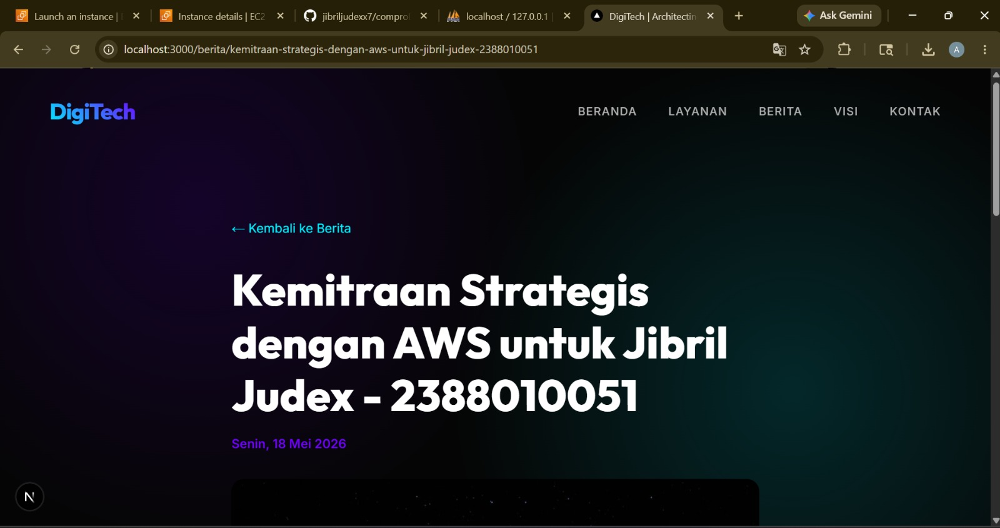

# Deploy Multi Apps CI/CD Docker

1. Start instances AWS 
2. Paching OS -> sudo apt-get update && sudo apt-get upgrade

3. Hapus Layanan nginx -> sudo systemctl stop apache2 && sudo systemctl disable apache2 -> sudo apt remove apache2
   - docker ps -la
   - docker start compro_2388010052
4. Hapus layanan Mariadb dan uninstall -> sudo systemctl stop mariadb && suddo systemctl desable mariadb
   - sudo apt auto-remove mariadb-server -> systemctl status mariadb mariadb-client mariadb-common
5. Testing Next.JS + db menggunakan user bukan root pada local environment
   - copy project Digitech pertemuan 6 kecuali folder .nex, node_modules, sql 
   
   - Create user baru bukan root di BMS (Laragon, xampp)
     - ke user akun
     - add user
     - username = usercompro_nim
     - Host name = localhost
     - pasword = *****
     - langsung go /  create
   - Klik user yang sudah di buat -> pilih database -> pilih dbcompro -> terus klik all -> go
   
   
   
   
   

    - sesuaikan file .env
    - open terminal -> cd web-dinamis
    - npm i
    - npm run dev -> cek website localhost
    