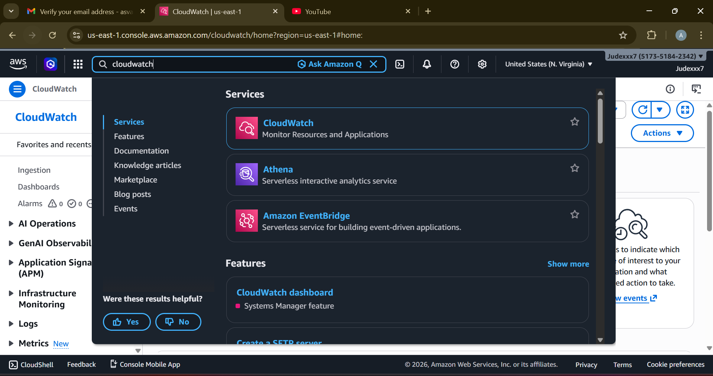
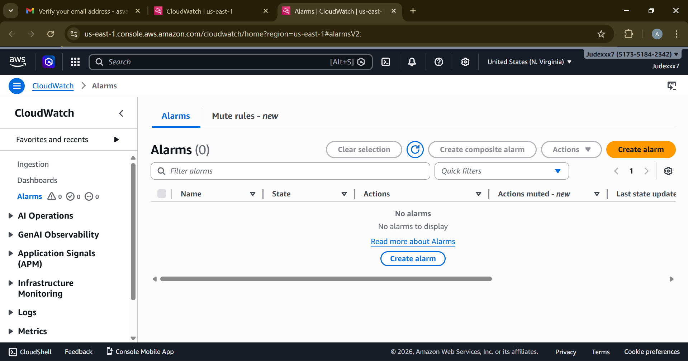
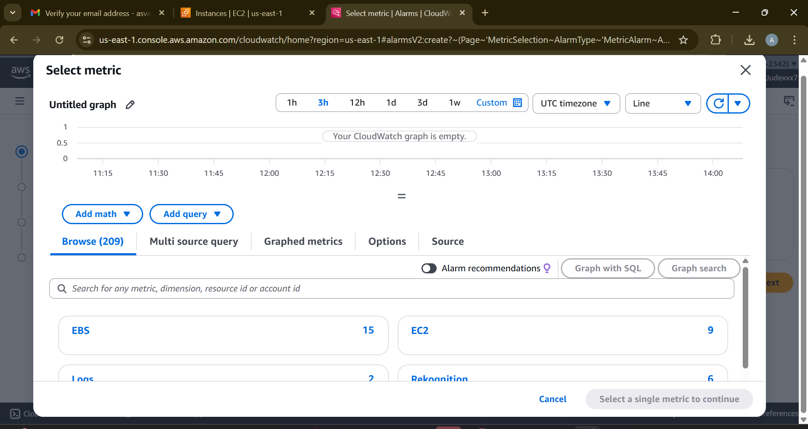
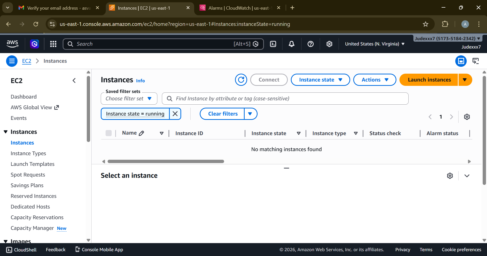
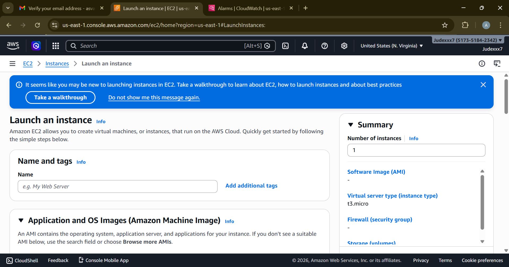
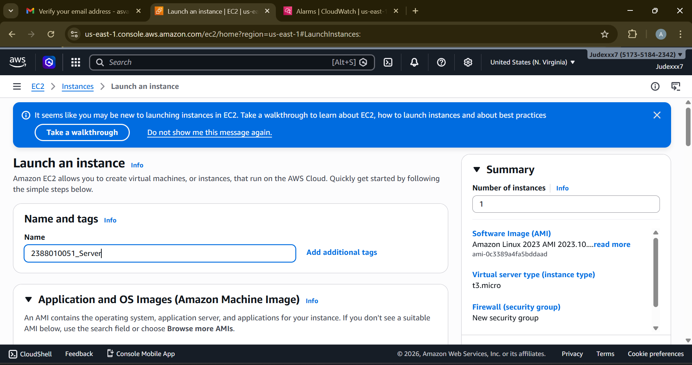
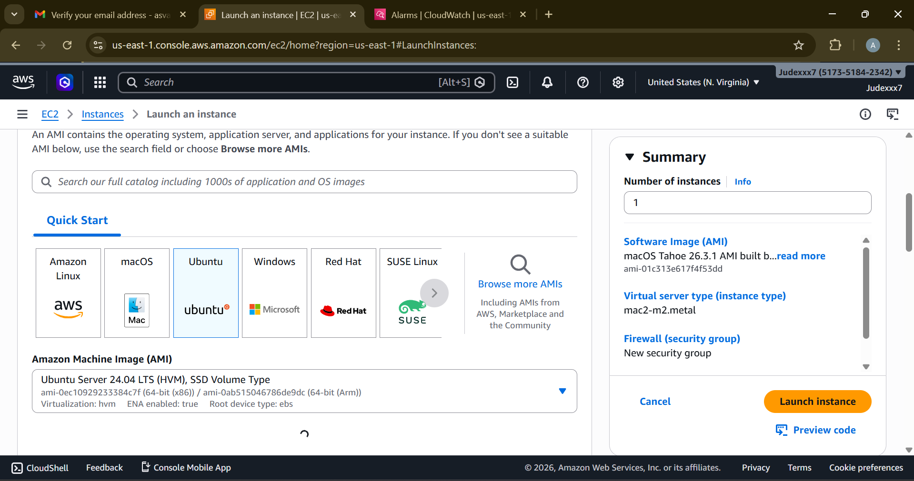

# Membuat Monitoring Billing Alert 

1. Mencari Menu CLoudWatch dan Klik 

2. Setelah masuk menu CloudWatch pilih Alarm

3. Pilih Create Alarm dan Pilih Metrics EC2

Pastikan region ada di US N Virginia

klik Metric

klik menu billing

pilih total perkiraan Biaya

ceklis Mata uang USD

Pilih Matrik

beri Nama metrik

scroll bawah pilih USD $

next (konfigurasi)

creat new topic => NIM_BillingAlert => Create

Kirim Pemberitahuan ke ... (NIM_BillingAlert) 

next

alarm name

next

buat alarm

selesai

Buka inbox/spam email dari AWS kemudian Klik Confirm.