# Remote Instance with SSH putty

1. Pastikan sudah install Putty 

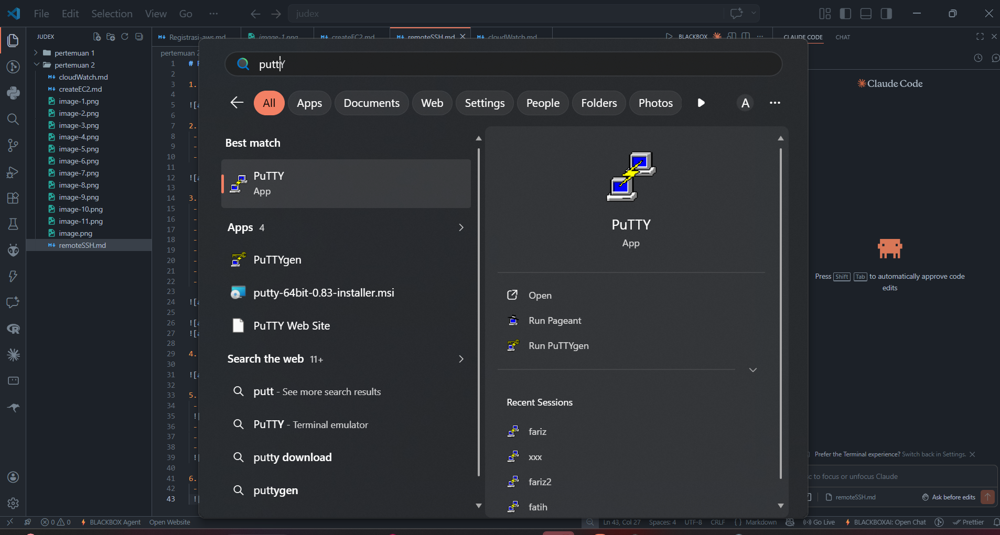

2. Konversi file Public Key dari .pem menjadi .ppk di putty
 - buka puttyGen
 - load File .pem
 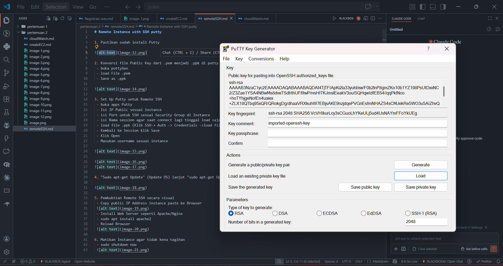
 - Save as .ppk
 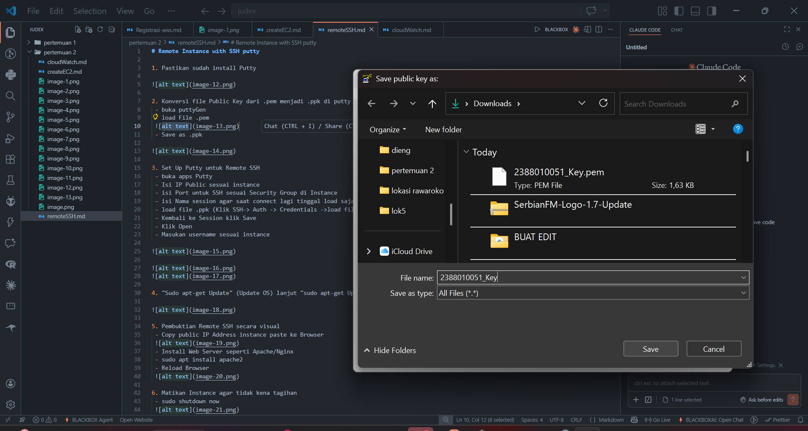

3. Set Up Putty untuk Remote SSH
 - buka apps Putty
 - Isi IP Public sesuai instance
 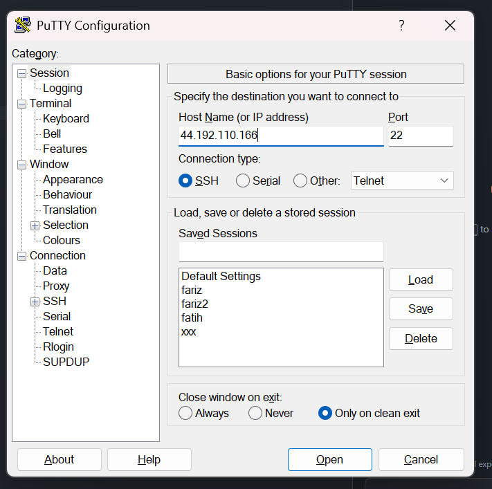
 - isi Port untuk SSH sesuai Security Group di Instance
 - isi Nama session agar saat connect lagi tinggal load saja
 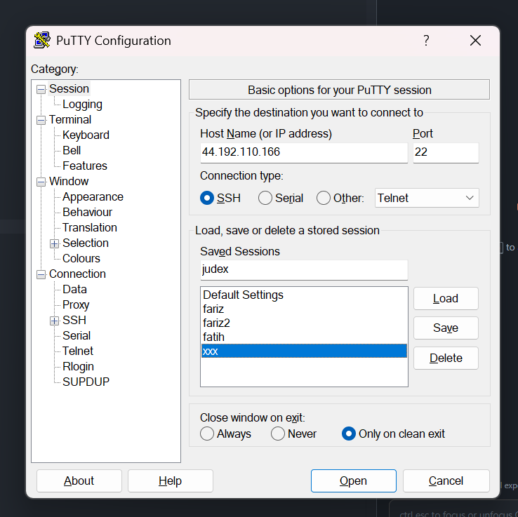
 - load file .ppk (Klik SSH-> Auth -> Credentials ->load file .ppk)
 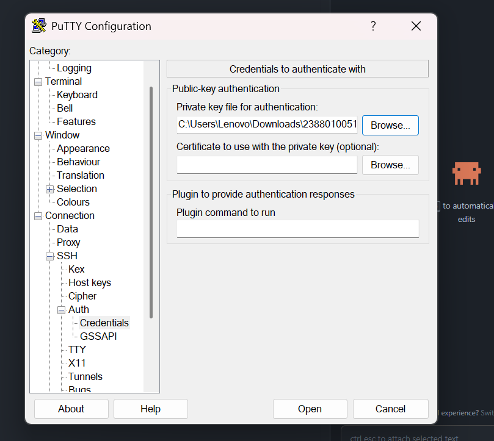
 - Kembali ke Session klik Save
 - Klik Open
 - Masukan username sesuai instance
 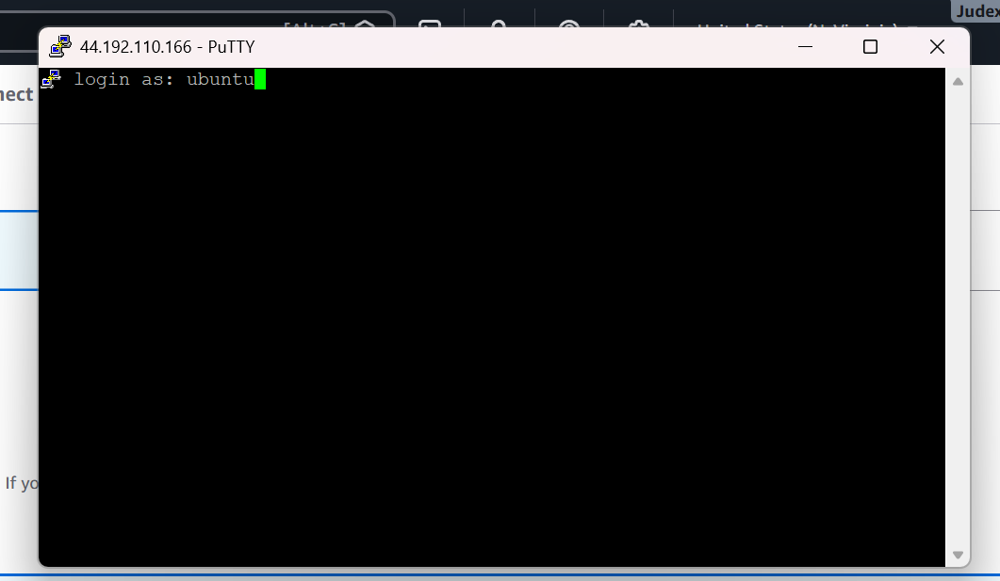

4. "Sudo apt-get Update" (Update OS) lanjut "sudo apt-get Upgrade"

5. Pembuktian Remote SSH secara visual
 - Copy public IP Address instance paste ke Browser
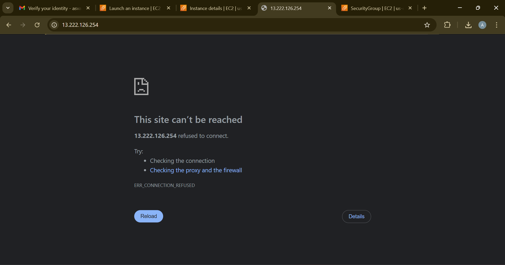
 - Install Web Server seperti Apache/Nginx 
 - sudo apt install apache2
 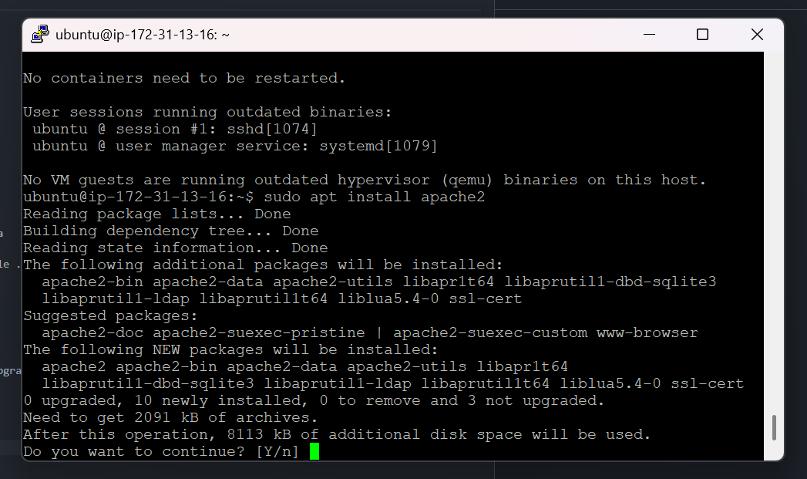
 - Reload Browser
 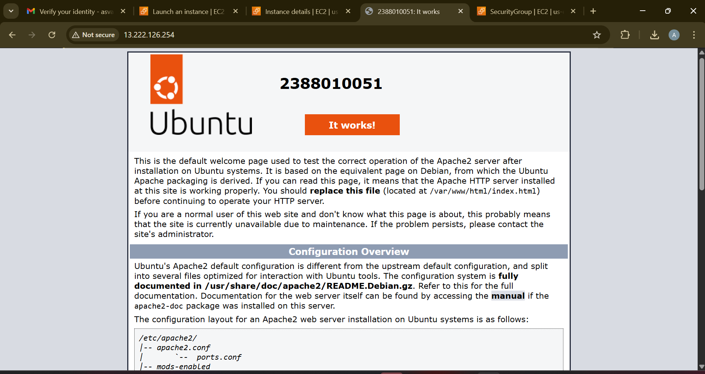

6. Matikan Instance agar tidak kena tagihan
 - sudo shutdown now 
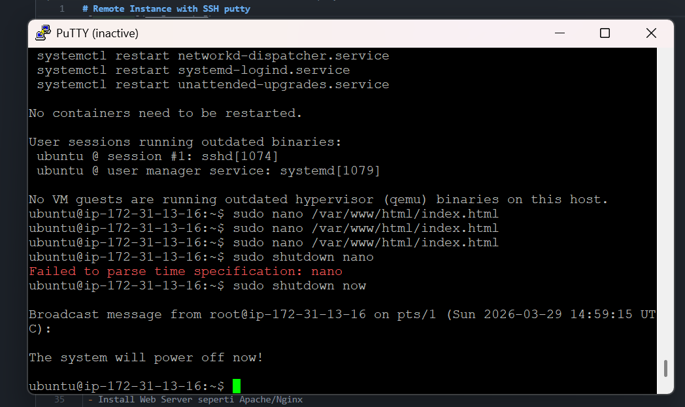