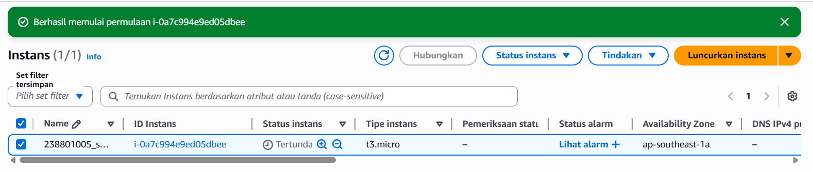
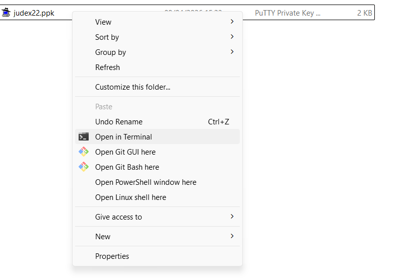
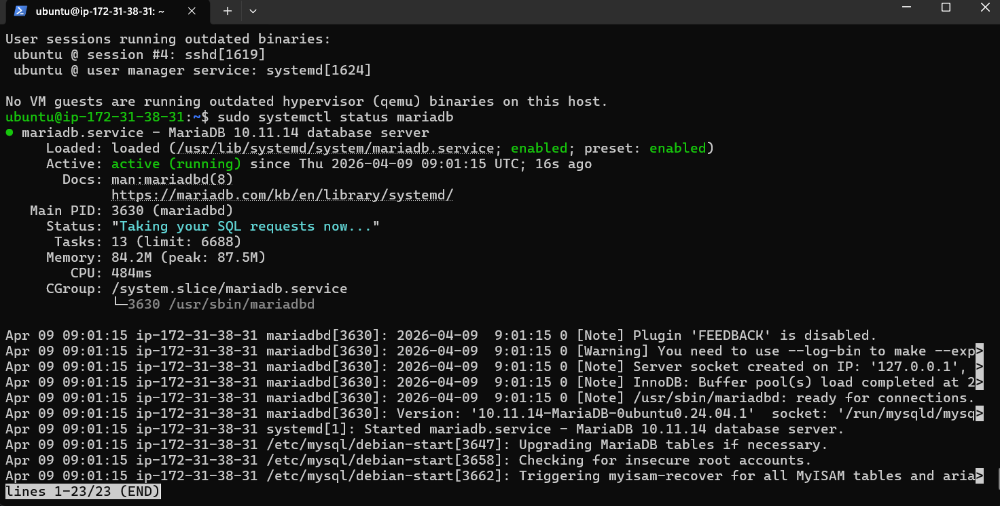
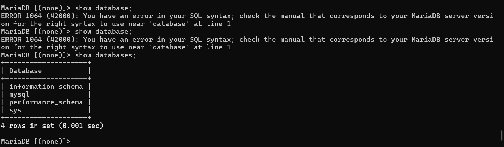
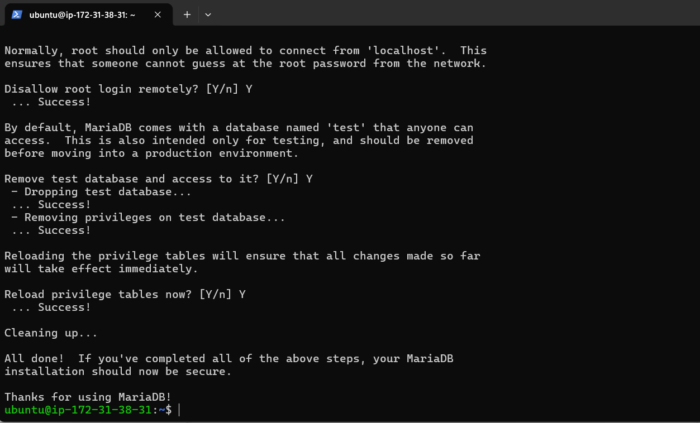
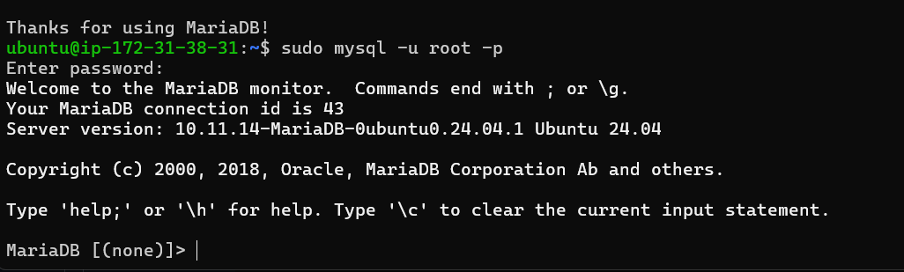
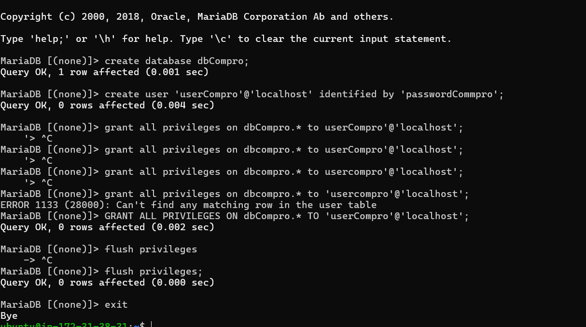
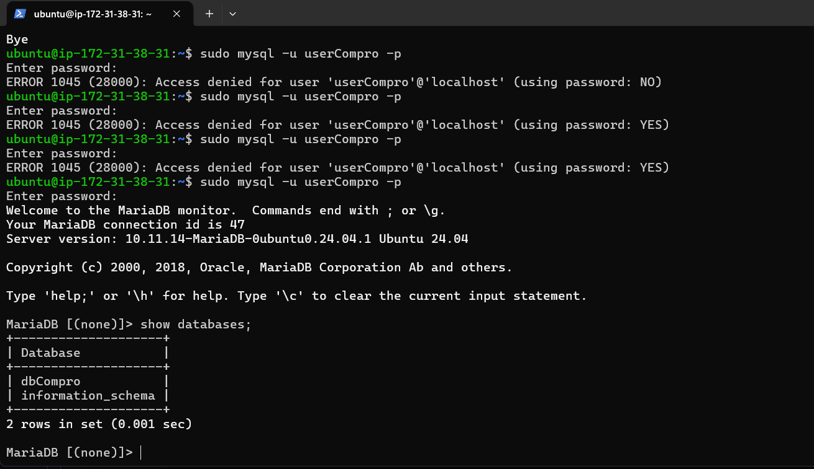

## Membuat Database MySql di AWS EC2

1. Aktifkan instance 

2. Remote SSH via Terminal 
   - Masuk ke folder penyimpanan private Key (Cari folder klik kanan-pilih terminal sambil klik shift dan ctrl) 
   
   - Masukan comman ssh -i key_2388010052.pem ubuntu@13.236.178.230
   - Tekan enter

3. Lakukan Pathching OS
   - sudo apt-get update && sudo apt-get upgrade

4. Kita akan install MariaDb
   - sudo apt-get install mariadb-server / mysql-server
   - sudo systemctl status mariadb
   - coba apakah default setting yg berlaku (sudo mysql -u root -p)
   - Cek apakah masih ada database dummy (show databases;)
   
   

5. Kita lakukan Hardening Security
   - Masukan Command sudo mysql_secure_installation - pw 123
   - Switch to unix_socket authentication : Y
   - Change the root password? : Y
   - Remove anonymous users? : Y
   - Disallow root login remotely? : Y
   - Remove test database and access to it? : Y
   - Reload privilege tables now? : Y
   
   - cek apakah bisa tanpa pw root
   

6. Membuat database dan User
   - membuat database untuk web company profile (create database dbCompro;)
   - membuat user untuk web company profile create user ('userCompro'@'localhost' identified by 'passwordCommpro';)
   - Memberikan Hak akses user untuk web company profile (grant all privileges on dbCompro.* to userCompro'@'localhost';)
   - flush privileges
   

7. Login menggunakan akun database yang sudah di buat
   - login menggunakan username (sudo mysql -u userCompro -p)
   - enter password yang sudah di buat (passwordCompro)
   - lihat database yang sudah dibuat (show databases;)
   

