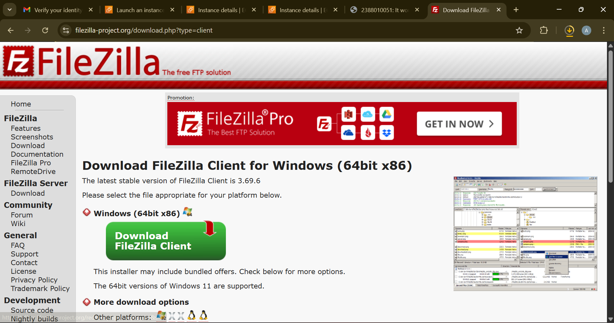
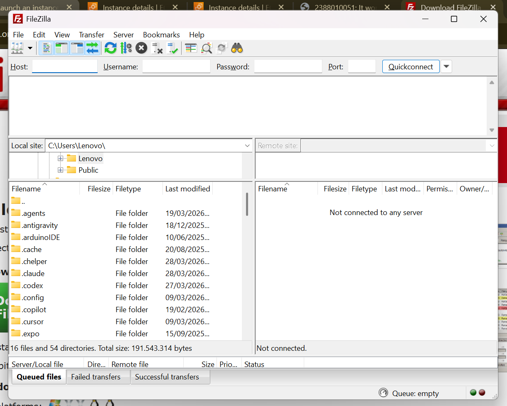
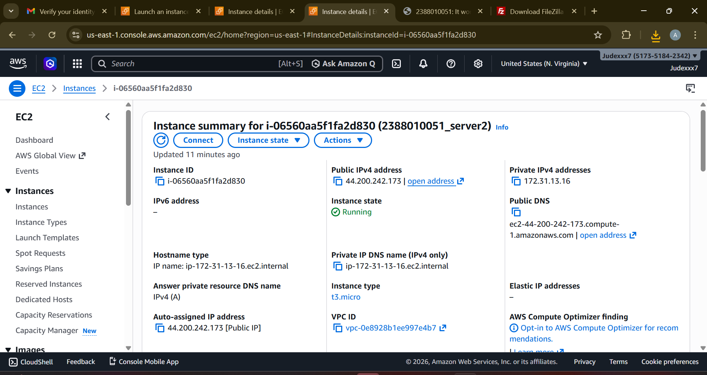
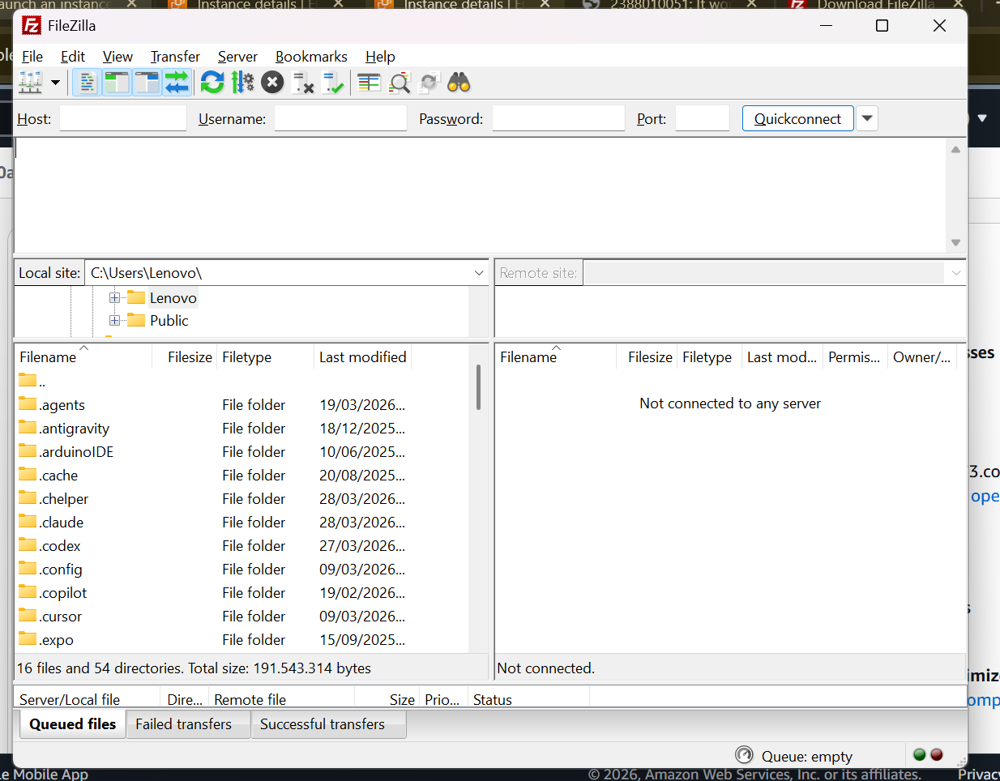
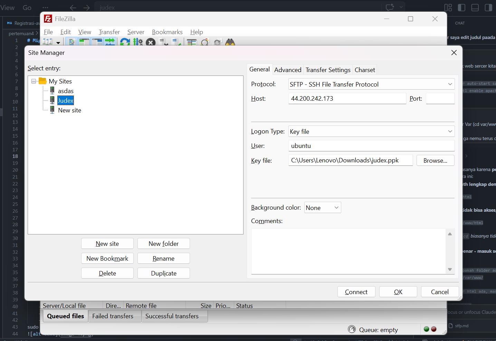
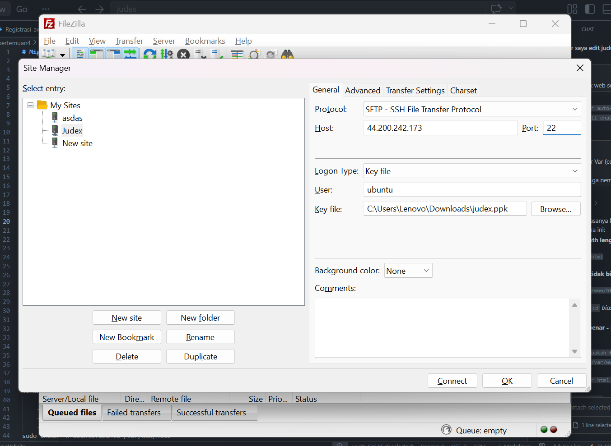
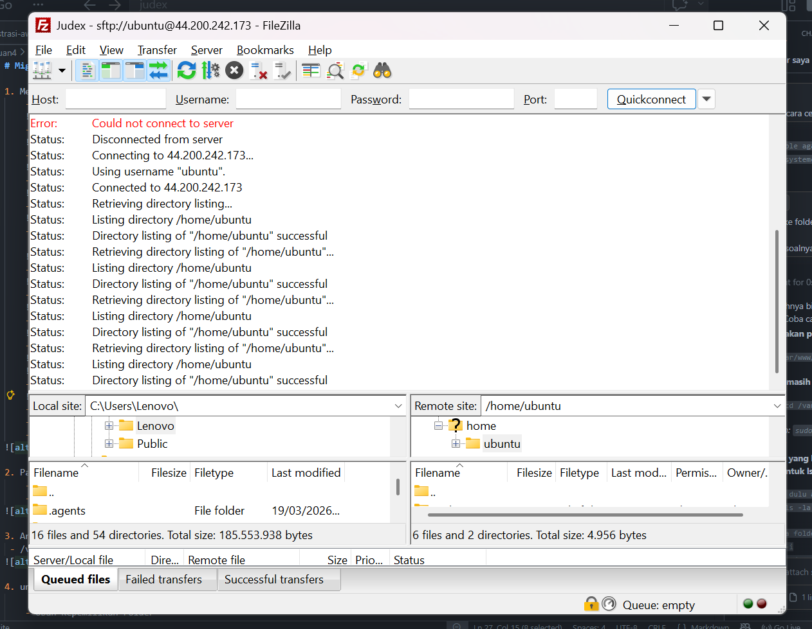
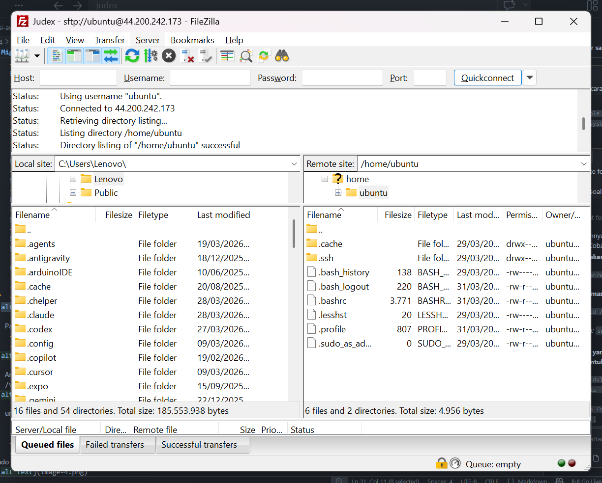
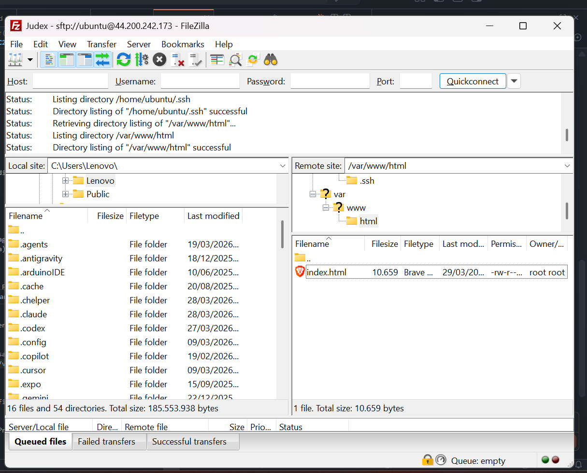

# Migrasi File Local ke Cloud Server (AWS EC2)

1. Memilih tools Migrasi File, misal kita akan gunakan Filezilla 
    - unduh dan Install di https://filezilla-project.org/download.php?type=client
    
    - Buka Filezilla Client
    
    - Aktifkan Instance di AWS
    
    - Kembali ke FileZilla Client
    
    - Klik File > Site Manager
    
    - Klik New Site 

    
    - Protocol > SFTP
    
    - Host > IP Public EC2
    
    - Port > 22
    
    - Logon Type > Key file
    
    
    - Key file > Pilih file .ppk / .pem yg didownload saat membuat instance
    
    - Klik Ok
    - CTRL + S
    - Klik Connect

2. Pada Dashboard utama fileZilla akan terbagi menjadi 2 panel
    - Panel Kiri > File Local (Komputer Anda)
    - Panel Kanan > File Server (AWS EC2)

3. Arahkan directory Cloud (Panel Kanan) ke Folder web server services area
 - /var/www/html

4. untuk solusi Permission Denied pada folder /var/www/html

    - Ubah Kepemilikan Folder
    - Mengubah folder /var/www/html agar bisa diakses oleh user 'ubuntu'
    - Sintaks: sudo chown -R ubuntu:ubuntu /var/www/html
sudo chown -R ubuntu:ubuntu /var/www/html

5. Edit File index.html menjadi company Profile 
    - Klik Kanan pada file index.html
    - Klik Edit
    - Edit File index.html menjadi company Profile 

